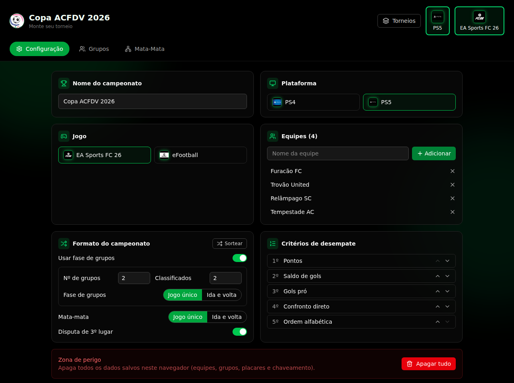

# 🏆 Tabela ACFDV

Site para organizar campeonatos de e-futebol (FIFA/EA Sports FC, eFootball) do zero: sorteio automático de grupos e mata-mata, tabelas de classificação, chaveamento visual, critérios de desempate configuráveis e suporte a jogos de ida e volta. Tudo salvo direto no navegador, sem backend.

[](https://brunokobi.netlify.app/)




## ✨ Funcionalidades

- **Sorteio automático** de equipes nos grupos e do chaveamento do mata-mata.
- **Fase de grupos**: tabela de classificação calculada automaticamente (pontos, saldo de gols, gols pró, confronto direto, ordem alfabética — critérios reordenáveis).
- **Mata-mata**: visão em tabela e visão em chaveamento (bracket), com W.O. automático quando o número de classificados não fecha em potência de 2, e W.O. manual em qualquer partida.
- **Ida e volta** configurável de forma independente para fase de grupos e mata-mata, com pênaltis quando o agregado empata.
- **Plataforma** (PS4 / PS5) e **jogo** (EA Sports FC 26 / eFootball) selecionáveis, com logo.
- **Persistência local**: tudo salvo automaticamente no `localStorage` do navegador. Botão de "Apagar tudo" na Configuração para zerar o campeonato.

## 📖 Manual de uso

### 1. Configuração

1. Dê um nome ao campeonato, escolha a **plataforma** (PS4/PS5) e o **jogo** (EA Sports FC 26/eFootball) — os selos aparecem no cabeçalho do site.
2. Cadastre as equipes uma a uma no campo "Nome da equipe".
3. Defina as regras:
   - **Usar fase de grupos**: desligue se quiser ir direto para o mata-mata (eliminação simples com todas as equipes).
   - **Número de grupos** e **classificados por grupo**.
   - **Fase de grupos** e **Mata-mata**: cada um pode ser jogo único ou ida e volta, de forma independente.
   - **Disputa de 3º lugar**: liga/desliga a partida entre os perdedores das semifinais.
4. Ajuste a ordem dos **critérios de desempate** arrastando com as setas ↑/↓ (a ordem é a prioridade usada para desempatar a tabela).
5. Clique em **Sortear grupos** — cada vaga é revelada com uma animação (~3s), com botão para pular. As equipes já ficam distribuídas nos grupos assim que o sorteio termina, mesmo pulando a animação.
6. Precisa recomeçar do zero? Use **Apagar tudo** na Zona de perigo — apaga times, grupos, placares e chaveamento salvos no navegador.

### 2. Fase de grupos (aba Grupos)

Cada grupo mostra sua **tabela de classificação**, atualizada automaticamente a cada placar lançado:

| Coluna | Significado |
|---|---|
| # | posição no grupo (linhas em verde = classificadas, conforme o nº de vagas configurado) |
| J | jogos disputados |
| V / E / D | vitórias / empates / derrotas |
| SG | saldo de gols |
| Pts | pontos (vitória = 3, empate = 1) |

O empate entre equipes é resolvido pela ordem de critérios definida na Configuração (pontos, saldo de gols, gols pró, confronto direto, ordem alfabética, etc.). Abaixo da tabela ficam os confrontos de cada rodada — digite o placar de cada lado para a tabela recalcular na hora.

### 3. Mata-mata (aba Mata-Mata)

1. Clique em **Sortear mata-mata** — pega os classificados dos grupos (ou todas as equipes, se a fase de grupos estiver desligada) e monta o chaveamento aleatoriamente, com a mesma animação de revelação.
2. Se o número de classificados não for uma potência de 2 (2, 4, 8, 16...), as equipes que sobrarem recebem **W.O. automático** e avançam direto para a próxima rodada.
3. Alterne entre **Tabela** (lista de confrontos por fase) e **Chaveamento** (bracket visual) a qualquer momento — os dois mostram os mesmos dados.
4. Em cada confronto, digite o placar (1 ou 2 jogos, conforme configurado). Se o agregado empatar após ida e volta, aparecem campos de **pênaltis**.
5. Precisa avançar uma equipe manualmente (adversário não compareceu, por exemplo)? Clique no botão **WO** ao lado do time — ele avança na hora, sem precisar de placar.

Tudo é salvo automaticamente no navegador: pode fechar a aba e voltar depois que o campeonato continua de onde parou.

## 🖥️ Stack

- [React 19](https://react.dev/) + [TypeScript](https://www.typescriptlang.org/)
- [Vite](https://vitejs.dev/) como build tool
- [Tailwind CSS 4](https://tailwindcss.com/) para estilos
- [Zustand](https://github.com/pmndrs/zustand) para estado global, com persistência em `localStorage`
- [lucide-react](https://lucide.dev/) para ícones

## 🚀 Rodando localmente

```bash
npm install
npm run dev
```

Abre em `http://localhost:5173` (ou a próxima porta livre).

Outros comandos:

```bash
npm run lint    # eslint
npm run build   # type-check (tsc) + build de produção
npm run preview # serve o build de produção localmente
```

## 📦 Deploy

Configurado para deploy estático direto no [Netlify](https://www.netlify.com/) (ver `netlify.toml`): build `npm run build`, publica a pasta `dist`.

## 📁 Estrutura

```
src/
  types.ts                 # modelo de domínio (times, grupos, partidas, config)
  lib/                     # lógica pura: round-robin, classificação, chaveamento
  store/                   # estado global (zustand + persist)
  components/
    config/                # configuração do campeonato
    groups/                # fase de grupos
    knockout/               # mata-mata (tabela + chaveamento)
    layout/                 # header, navegação, background, footer
    shared/                 # componentes reutilizáveis (score input, logo)
```

## 🛠️ Para quem for mexer no código

Decisões de arquitetura, pegadinhas do ambiente de dev (WSL) e um bug já corrigido que
vale a pena conhecer antes de alterar o chaveamento ou o fundo: [`docs/NOTAS-TECNICAS.md`](docs/NOTAS-TECNICAS.md).

---

© 2026 [Bruno Kobi](https://brunokobi.netlify.app/). Todos os direitos reservados.
